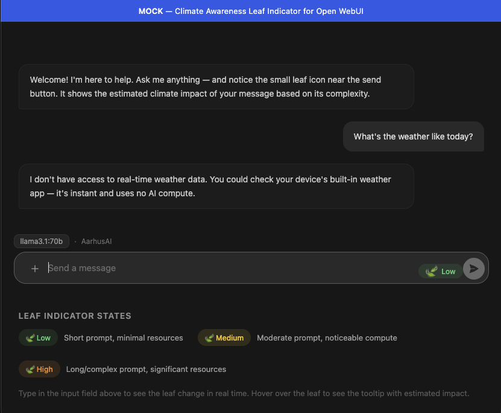
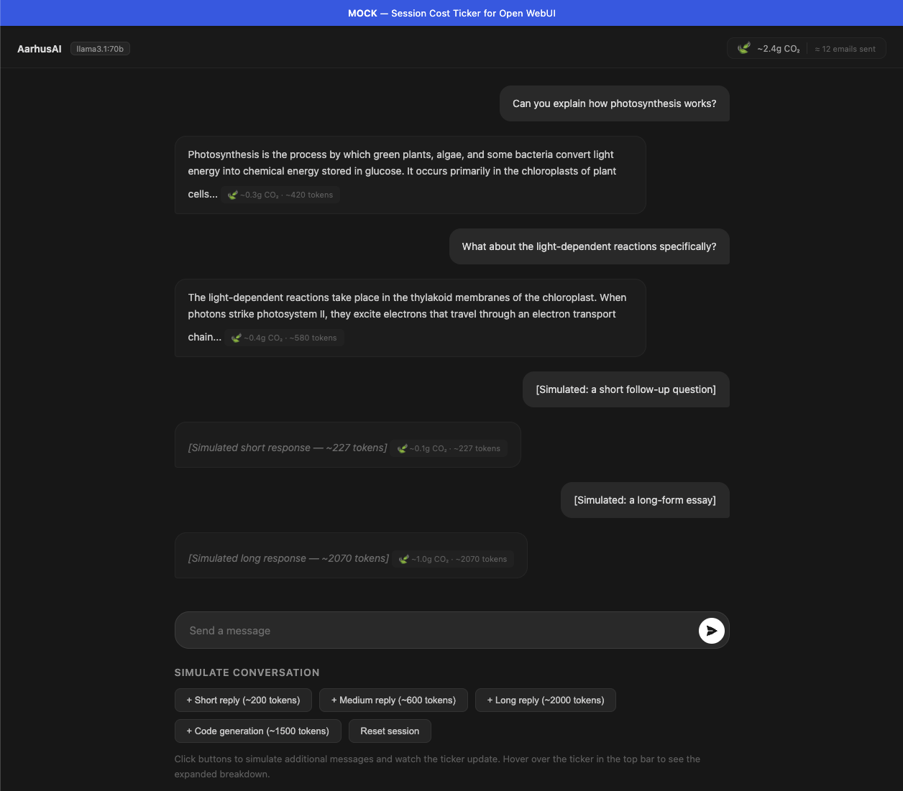
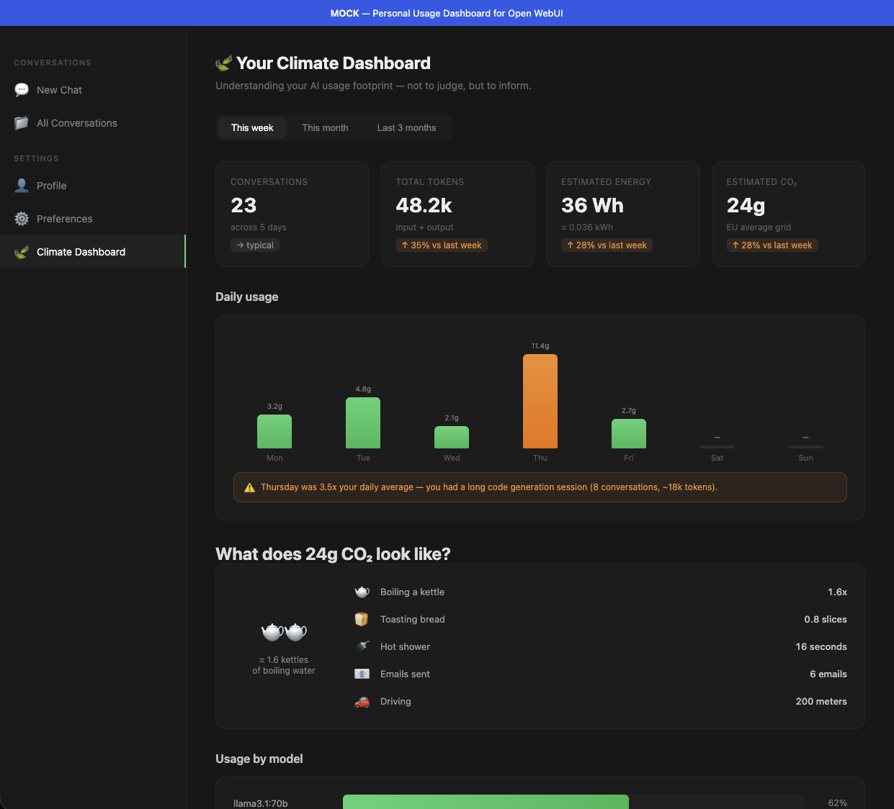

# Climate Awareness for AI Usage

**Research, Findings, and Evaluation**

**Prepared for:** AarhusAI / Aarhus Kommune
**Date:** April 2026
**Status:** Draft

---

## Introduction

Generative AI is becoming a standard tool in public organizations. As usage scales, so does its energy and climate footprint. This document explores how to make AI users more conscious of the resources their usage consumes — without guilt-tripping, without blocking workflows, and without false precision.

The goal is not to reduce AI usage. The goal is to help users make **informed choices** about when and how they use AI.

---

## The Problem

- AI-generated content often creates downstream AI work (e.g., a long generated email that a colleague asks AI to summarize)
- Users have no visibility into the resource cost of their queries
- Simple tasks (checking the time, basic arithmetic) are routed through expensive models
- There is no feedback loop between usage and awareness

---

## Design Principles

1. **Inform, don't shame** — show data neutrally, let the user draw conclusions
2. **Low friction** — awareness should not interrupt workflow
3. **Contextual** — nudge at decision points, not constantly
4. **Actionable** — give the user something they can actually do differently
5. **Opt-in depth** — summary by default, details on demand

---

## What We Know About AI's Climate Impact

!!! info "Full research"
    See the complete [CO2 Research](co2-research.md) document for detailed findings and sources.

### The headline numbers

- A typical LLM query uses **~0.3 Wh** of energy (Epoch AI, 2025; confirmed by OpenAI)
- CO2 per query ranges from **0.03g to 10g+** depending on grid, model, and infrastructure
- The **200x disagreement** between estimates is the defining challenge — assumptions matter more than measurements

### What makes it hard

- Grid carbon intensity varies 40x between regions (Nordic hydro vs. coal grids)
- No major AI provider publishes per-query energy data
- Reasoning models can use 70x+ more energy than simple models
- Efficiency improves, but total demand grows faster (Jevons' Paradox)

### Honest framing

For an individual user, the CO2 from AI queries is small compared to daily activities. But at organizational and societal scale, AI's aggregate energy footprint is growing rapidly and is projected to double by 2030 (IEA). Both things are true — awareness should address the systemic picture, not guilt individual users.

---

## Nudging Strategies

!!! info "Full ideas list"
    See the complete [Nudge Ideas](ideas.md) document for all 17 ideas with details.

### Pre-request nudges
- **Leaf indicator** — visual prompt complexity hint (see [Mock 1](#mock-1-leaf-indicator))
- **"Save by doing it yourself"** — tie simple-task detection to cost savings
- **Purpose selector** — optional self-tagging for reflection
- **Audience awareness** — "Who will read this?"

### In-session nudges
- **Session cost ticker** — running estimate with everyday equivalences (see [Mock 2](#mock-2-session-cost-ticker))
- **Generation size awareness** — flag long-form output requests
- **Redundancy detection** — catch rephrased repeat questions

### Post-session nudges
- **Personal usage dashboard** — trends, equivalences, tips (see [Mock 3](#mock-3-personal-usage-dashboard))
- **Spike warnings** — flag unusual usage patterns
- **Team comparison** — anonymized, opt-in

### Systemic nudges
- **AI chain detection** — catch generate-then-summarize patterns
- **Model selection** — suggest lighter models for simple tasks
- **Cache/reuse** — surface previous answers to repeated org questions

---

## UI Concepts and Mocks

### Mock 1: Leaf Indicator

The leaf indicator is a small icon in the chat input area that changes color based on estimated prompt complexity.

**States:**

- **Green (Low)** — short prompt, minimal resources
- **Yellow (Medium)** — moderate prompt, noticeable compute
- **Orange (High)** — long/complex prompt, significant resources

**Behavior:** Updates in real-time as the user types. Hovering shows a tooltip with estimated impact and an everyday equivalence.

[Interactive prototype :material-open-in-new:](mocks/leaf-indicator.html){ .md-button }



### Mock 2: Session Cost Ticker

A running cost estimate displayed in the top bar of the chat interface. Shows cumulative CO2 and an everyday equivalence. Hovering reveals a detailed breakdown panel with tokens, energy, and multiple equivalences.

**Features:**

- Running total updates after each message
- Per-response cost tags below each AI response
- Expandable detail panel on hover
- Everyday equivalences that scale with usage

[Interactive prototype :material-open-in-new:](mocks/session-cost-ticker.html){ .md-button }



### Mock 3: Personal Usage Dashboard

A dedicated dashboard page showing the user's AI usage over time, with charts, equivalences, model breakdowns, and contextual tips.

**Features:**

- Summary cards (conversations, tokens, energy, CO2) with trend indicators
- Daily usage bar chart with spike detection and warnings
- Visual equivalences section ("What does 24g CO2 look like?")
- Usage breakdown by model, with efficiency suggestions
- Contextual tips based on actual usage patterns
- User preference picker for equivalence units (kettle boils, toast, shower minutes, etc.)

[Interactive prototype :material-open-in-new:](mocks/usage-dashboard.html){ .md-button }



---

## Integration Points

!!! info "Full technical details"
    See the complete [Integration Points](integration.md) document.

### Open WebUI
- **Pipelines** for backend logic (token counting, cost estimation, pattern detection)
- **Custom CSS/Docker** for UI modifications (leaf icon, cost ticker)
- **Filter pipelines** for pre-request nudges

### Claude Code
- **Hooks system** for post-response cost display
- **Status line** for session cost ticker
- **MCP server** for usage tracking

### API/Proxy Layer
- Platform-agnostic request/response logging
- Cost metadata injection via response headers
- Centralized usage dashboards

---

## Guidance to Hosting Providers

!!! info "Full research"
    See [CO2 Research — Guidance to Hosting Providers](co2-research.md#5-guidance-to-hosting-providers) for the complete list.

### The ask

To provide honest, qualified estimates to users, we need hosting providers to disclose:

**Essential:**

- GPU hardware model
- Average GPU utilization during inference
- Data center location
- Facility PUE
- Electricity source and grid mix

**Valuable:**

- Quantization level
- Inference framework
- Average tokens per query
- CUE and WUE metrics

**Ideal:**

- Time-resolved grid carbon intensity
- Embodied carbon of hardware
- Per-query energy telemetry or API response headers

### The minimum viable transparency

Even a simple API response header would transform accuracy:

```
X-Estimated-Energy-Wh: 0.3
X-GPU-Model: H100
X-Data-Center-Region: eu-north-1
```

---

## Evaluation and Recommendations

### Recommended first steps

1. **Leaf indicator** — high visibility, low friction, no provider data needed (estimate from prompt length)
2. **Session cost ticker** — builds ongoing awareness during use
3. **Generation size awareness** — high-impact nudge for the biggest waste pattern
4. **Hosting provider outreach** — send guidance document, start the conversation

---

## Open Questions and Next Steps

- [ ] Validate CO2 estimates with AarhusAI's actual infrastructure data
- [ ] User test the leaf indicator concept — does it change behavior?
- [ ] Determine appropriate nudge frequency — too little = ignored, too much = annoying
- [ ] Legal/privacy review for usage tracking and dashboards
- [ ] Measure baseline usage patterns before introducing nudges
- [ ] Design A/B testing framework for nudge effectiveness

---

## Sources

See [CO2 Research](co2-research.md#sources) for the full source list with links.
