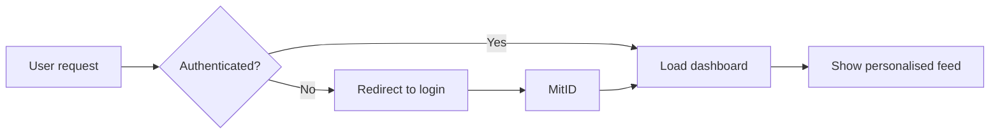
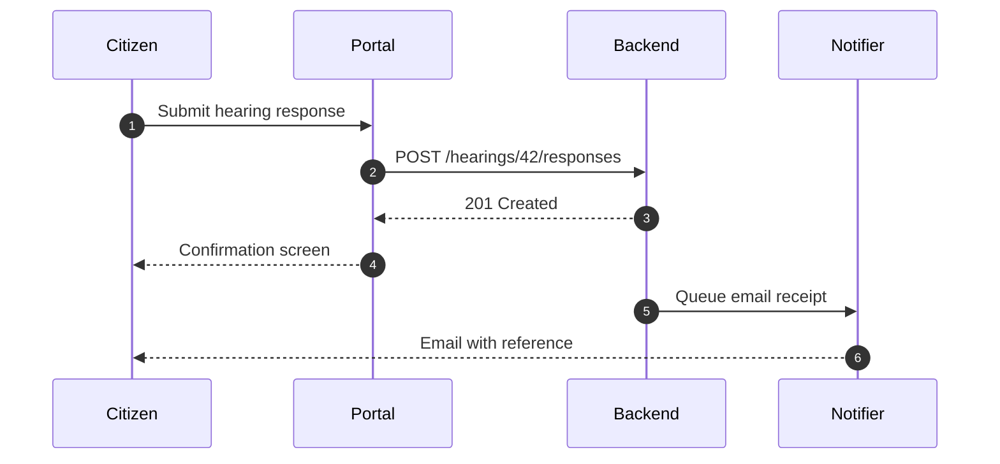
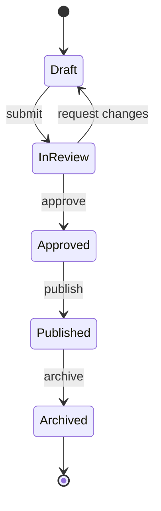
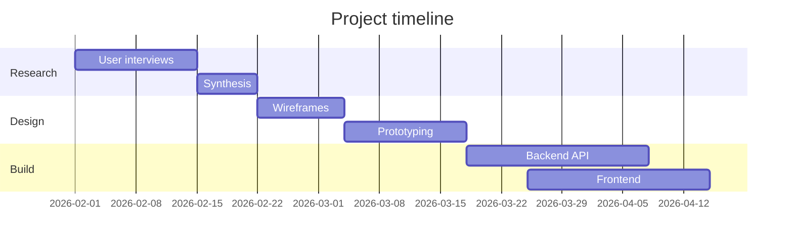
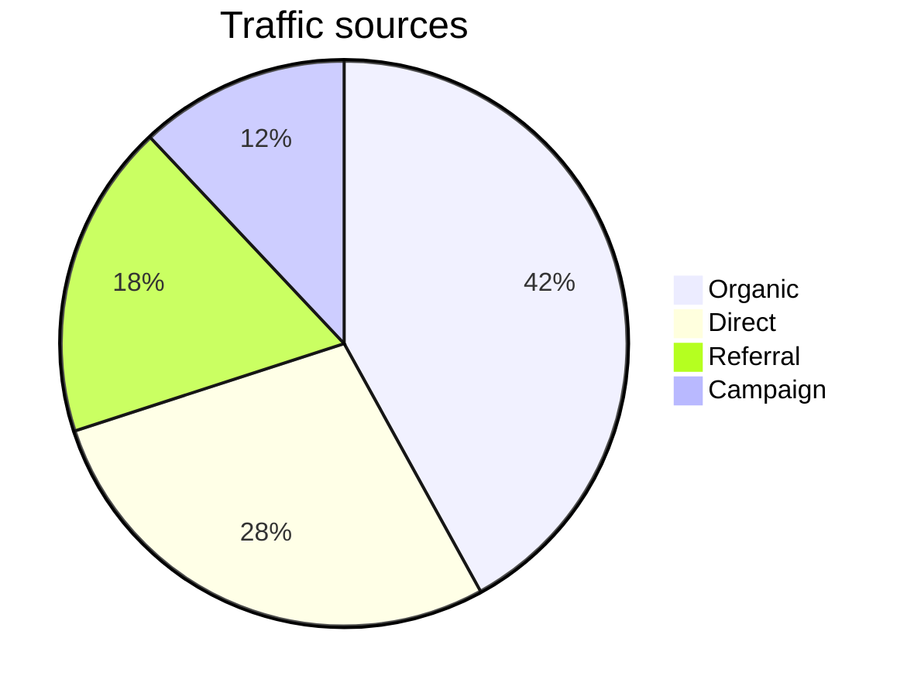
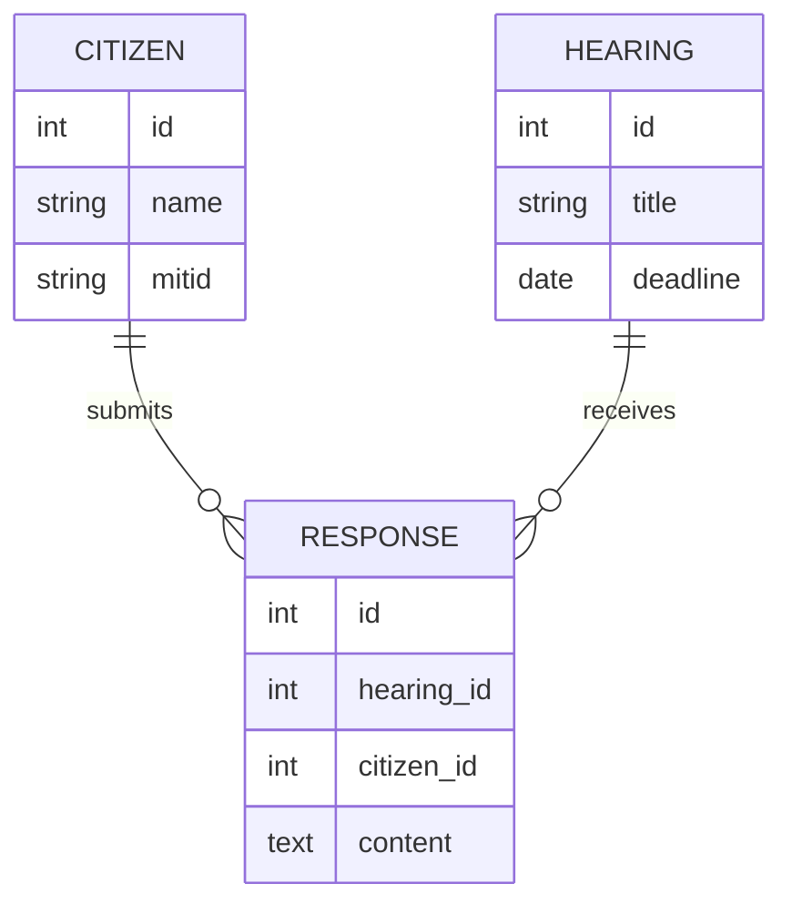
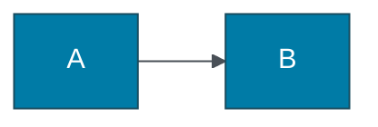

<small>**Project:** ITK Dev Design System</small>

# Diagrams

Mermaid is wired into VitePress via `vitepress-plugin-mermaid`. Use it
inside any research project's Markdown for flowcharts, sequence diagrams,
gantt charts, and more.

::: info Tip
Diagrams live in Markdown, not in prototypes. For interactive charts
inside mock HTML files, see [Data viz](/projects/design-system/data-viz).
:::

## Flowchart



## Sequence diagram



## State diagram



## Gantt



## Pie



## ER diagram



## Theming

Mermaid respects VitePress's light/dark mode automatically. For
per-diagram tweaks, start the code block with `%%{init: ...}%%`:

````markdown

````
