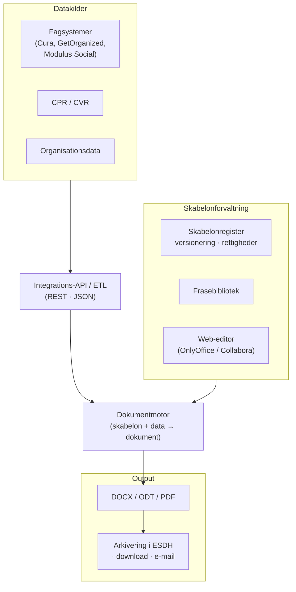

<small>**Project:** Fælles Skabelonløsning · **Status:** Analyse / oplæg · **Date:** juni 2026</small>

# Fælles Skabelonløsning

**Et open source-alternativ til DynamicTemplate — en delbar skabelonløsning bygget på åbne standarder, som kan udvikles i fællesskab via OS2 og frigøre kommunerne fra dyr leverandørafhængighed.**

---

## Baggrund

Aarhus Kommune har i 12 år anvendt **DynamicTemplate** fra Dania Software som fælles skabelonløsning. Løsningen integrerer med Office-produkterne og fagsystemerne Cura, GetOrganized og Modulus Social. I dag er der:

- **2.263 unikke brugere**, der aktivt anvender løsningen
- **2.464 unikke skabeloner**
- **mere end 10.000 fraser**

Dania Software er opkøbt af Omnidocs, som har lanceret **Create** — en cloudbaseret erstatning for DynamicTemplate med en annonceret, væsentlig prisstigning. Det har fået Digitaliseringsstyregruppen (DSG) til at tage stilling til fire scenarier for den fremtidige skabelonløsning:

| Scenarie | Indhold |
|---|---|
| 1 | Fortsæt med DynamicTemplate |
| 2 | Skift til cloudløsningen Create |
| 3 | **Udvikling af en alternativ, åben løsning** |
| 4 | Brug kun skabelonløsninger i fagsystemerne |

Dette notat behandler **Scenarie 3**. Scenariet er behæftet med de største usikkerheder og kræver — jf. DSG-indstillingen — yderligere analyse samt eventuelt et tilbud fra ITK. Formålet her er at levere netop den analyse, som grundlag for en ansøgning om økonomi til at bygge løsningen.

::: info Hvorfor Scenarie 3?
En åben løsning reducerer afhængigheden af dyre Office-licenser og af en enkelt leverandør, understøtter et længe ønsket behov for integration i Microsoft 365 Online, og kan — bygget på åbne standarder — deles og samudvikles med andre kommuner via OS2. Det er i tråd med den fællesoffentlige digitaliseringsstrategi, EU's interoperabilitetsprincipper og ønsket om digital suverænitet.
:::

## Formål

Notatet undersøger spørgsmålet: **Hvordan kan en åben, delbar skabelonløsning bygget på åbne standarder se ud i praksis — og hvad koster det at bygge den?**

Output er, jf. oplægget:

- en **løsningsbeskrivelse** (dette dokument)
- **spørgsmål der skal afklares** yderligere
- et **estimat med usikkerheder** (se [Estimeringsnotat](./estimeringsnotat))
- en **visualisering af administrationsgrænsefladen** (se den [interaktive prototype](#interaktiv-prototype))

## Kernekomponenter

Løsningen består af otte kernekomponenter:

| Komponent | Formål |
|---|---|
| **Skabelonregister** | Versionering, rettigheder, ejerskab, metadata, gyldighed og publicering af skabeloner |
| **Frasebibliotek** | Centrale tekstblokke med versionering, fagligt ejerskab og adgangsstyring |
| **Datamodel** | Fælles struktur for afsender, modtager, organisation, sagsdata, CPR/CVR-data og fagsystemdata |
| **Dokumentmotor** | Genererer DOCX, ODT, PDF og evt. HTML fra skabelon og data |
| **Integrations-API** | Gør det muligt for Cura, GetOrganized, Modulus Social og andre systemer at kalde løsningen |
| **Klienter** | Word add-in, LibreOffice-extension, webportal og integration til onlinekontorpakker |
| **Adminmodul** | Skabelonredigering, test, publicering, statistik, logning og governance |
| **Migreringsværktøj** | Udtræk, analyse og konvertering af eksisterende skabeloner og fraser |

## Arkitektur

Arkitekturen bygger på åbne standarder og open source-komponenter. Data hentes fra fagsystemer via API'er, flettes ind i en skabelon af en dokumentmotor og leveres som DOCX, ODT eller PDF — med et separat lag til redigering, lagring og versionering af selve skabelonerne.

::: info Klienter og glidende overgang
Brugerne møder løsningen via flere klienter — en **webportal**, en **Word add-in** og en **LibreOffice-extension** — så overgangen kan ske gradvist uden at tvinge alle over på ét format eller én klient på én gang.
:::

## Åbne standarder og open source

Løsningen skal kunne deles via OS2 og overholde deres principper, og den skal bygge på åbne standarder. Relevante formater og kandidatkomponenter, der bør undersøges i en afklaringsfase:

- **Formater:** ODF (ODT) som åbent kerneformat, med output også i DOCX og PDF for at sikre en glidende overgang.
- **Dokumentmotor:** docxtemplater (template + JSON → DOCX), Jinja2, Open Document Mail Merge (ODMM), LibreOffice Mail Merge.
- **PDF:** WeasyPrint (HTML + CSS → PDF) eller tilsvarende.
- **Web-editor / samarbejde:** OnlyOffice eller Collabora Online.
- **Lagring og versionering:** afklares — git er teknisk uegnet til binære docx/odt-filer; et DMS (fx Nextcloud) er en mulighed, men tilfører et ekstra led, der skal driftes.

En løsning baseret på åbne standarder og open source kan med fordel samudvikles og genbruges via fx **OS2** eller **KOMBIT**. Tilsvarende offentlige initiativer findes allerede i bl.a. Tyskland (Bundesdruckerei, ODF), Frankrig (OpenFisca + Mako Templates) og Norge (Open eGov, XSLT/HTML-fletning).

## Hensyn fra udviklingsteamet

::: warning To centrale forbehold skal adresseres i designet
**1. Glidende overgang frem for et stort spring.** Med flere tusind brugere er det risikabelt at flytte alle over på ODT, Markdown eller git på én gang. Nextcloud og git løser et lagrings­problem, men er et stort skridt for brugerne og endnu et led at vedligeholde. Designet skal muliggøre en gradvis migrering — ikke en "big bang".

**2. Komplekse skabeloner, ikke kun simple placeholders.** Flere skabeloner kan ikke løses med simple `{navn}`/`{dato}`-placeholders. Der findes i dag Word-makroer, der interaktivt beder brugeren om en række input. Hvis motoren kun understøtter simpel substitution, bygger projektet sig ind i et hjørne, hvor en POC er mulig, men nye features bliver dyre. Motoren skal fra start kunne håndtere **betingede felter, gentagelige sektioner og brugerstyrede input-flows**.
:::

## Faseopdelt tilgang

For at imødegå usikkerheden startes småt og udvides, efterhånden som koncept og behov afklares:

- **Fase 0 — Afklaring.** Lagringsmodel, format-standard, governance, strategi for komplekse skabeloner og fagsystem-snitflader.
- **Fase 1 — POC.** En skabelonmotor der fletter JSON-data ind i 1-2 reelle Aarhus-skabeloner og udskriver DOCX og PDF.
- **Fase 2 — MVP.** Skabelonregister, frasebibliotek, adminmodul-UI, web-editor og første fagsystem-integration.
- **Fase 3 — Fuld løsning.** Integrations-API til fagsystemerne, Word add-in og LibreOffice-extension, migreringsværktøj og OS2-udgivelse.

Se [Estimeringsnotat](./estimeringsnotat) for timeestimat, tidshorisont og forbehold.

## Hvad prototypen viser

Den interaktive prototype visualiserer **administrationsgrænsefladen** — den del fagredaktører og administratorer arbejder i. Den er klientside-only (ingen backend) og et visuelt diskussionsgrundlag, ikke en færdig løsning. Den viser:

- **Skabelonregister** — liste over skabeloner med version, ejer, magistratsafdeling og status (kladde / publiceret / udløbet), med søgning og filtre. Bruger reelle Aarhus-eksempler (AK notat, Forklæde Chefmøde, Temadrøftelse).
- **Frasebibliotek** — centrale tekstblokke med fagligt ejerskab, version og adgang.
- **Skabelon-detalje og redigering** — placeholders, kolofon-data (afsender, sagsbehandler, DokID fra GetOrganized) og et eksempel på et **komplekst input-flow**, der adresserer makro-behovet.
- **Dokumentmotor-preview** — udfyld med testdata og generér DOCX/PDF (simuleret).

## Spørgsmål der skal afklares

1. **Lagring og versionering.** Git er uegnet til binære docx/odt-filer. Skal der bruges et DMS (Nextcloud/Alfresco), og hvilke ulemper (ekstra drift, brugervenlighed) accepteres?
2. **Brugerparathed til åbne formater.** Er brugerne klar til ODT/Markdown, eller skal DOCX forblive det primære arbejdsformat i en overgangsperiode?
3. **Komplekse skabeloner.** Hvordan erstattes Word-makro-baserede input-flows — betingede felter, gentagelige sektioner, guidede formularer?
4. **Fagsystem-integration vs. indbyggede løsninger.** Skal Cura, GetOrganized og Modulus Social integrere med den fælles løsning, eller bruge deres egne indbyggede skabelonløsninger? Hvordan håndteres "skjulte" integrationer, hvor brugere åbner Word-dokumenter i fagsystemet?
5. **Migrering.** Hvordan udtrækkes, analyseres og konverteres 2.464 skabeloner og 10.000+ fraser? Hvor meget kan automatiseres?
6. **Hosting og ejerskab.** Hvem driver og betaler for platformen — et OS2-fællesskab, en værtskommune eller en central aktør?
7. **Governance.** Hvordan sikres kvalitet, fagligt ejerskab og rettigheder til delte skabeloner og fraser på tværs af organisationer?

## Succeskriterie

En fungerende **POC**, der fletter JSON-data ind i 1-2 reelle Aarhus-skabeloner og udskriver korrekt formateret DOCX og PDF — sammen med en demonstrerbar **administrationsgrænseflade**. POC'en skal samtidig afklare, om motoren kan håndtere kravet om komplekse skabeloner, så projektet ikke bygger sig ind i et hjørne.

---

## Interaktiv prototype

<a href="/research-projects/projects/skabelonloesning/mocks/index.html" class="mock-button" target="_blank">Åbn administrationsgrænsefladen ↗</a>
